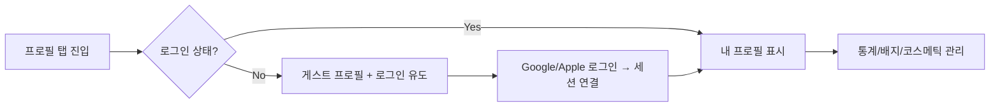

현재 `QuizRoom`의 전체 구조와 빌드 플랜을 보면 프로필 화면은 **“소셜 + 개인화 중심 허브”**로 설계하는 게 자연스러워요.
이를 기준으로 **로그인 유저 / 게스트 유저 구분 UX**를 아래처럼 제안할게요 👇

---

## 🎯 프로필 스크린 구성 개요

| 구분  | 로그인 유저                                 | 게스트 유저                                   |
| --- | -------------------------------------- | ---------------------------------------- |
| 상단  | 프로필 아바타 + 닉네임 + 이모지 프레임                | 기본 아바타(회색) + “게스트” 표시                    |
| 요약  | XP / 스트릭 / 배지 / 최근 카테고리                | “로그인하면 나만의 기록이 저장돼요”                     |
| 섹션  | ① 나의 퀴즈 히스토리 ② 배지·코스메틱 ③ 설정/로그아웃 | ① 로그인 유도 카드 ② 샘플 배지/통계 티징 ③ 로그인 버튼 |
| CTA | “프로필 편집” / “공유 카드 보기”                  | “Google/Apple로 로그인”                      |

---

## 🧱 구성 섹션 (UX 플로우)

### 1️⃣ 헤더 영역

**(로그인)**

* 아바타(프레임/이모지 포함)
* 닉네임 + 짧은 상태문구 (“🔥 연속 3일 출석 중”)
* [프로필 편집] 버튼

**(게스트)**

* 기본 회색 프로필 이미지
* “게스트 사용자” 텍스트
* 하단에 CTA 버튼:

  > “✨ 로그인하고 나만의 퀴즈 히스토리를 쌓아보세요!”
  > → 버튼: [Google 로그인] [Apple 로그인]

---

### 2️⃣ 메인 카드 섹션

**(로그인 유저용)**

| 카드         | 내용                           |
| ---------- | ---------------------------- |
| 🏆 최근 성적   | “이번 주 평균 정답률 78% / 스피드 4.5초” |
| 🔥 스트릭     | “연속 5일 출석!” + 프로그레스바         |
| 🎯 관심 카테고리 | 태그칩 “K-POP” “예능/OTT” “테크” 등  |
| 🪄 보유 코스메틱 | 프레임/이모지 미리보기 + [변경] 버튼       |

**(게스트용)**

* 블러 처리된 카드 형태로 “잠금🔒” 표시
* 각 카드 클릭 시
  → “로그인하면 내 통계와 배지를 볼 수 있어요”
  → 로그인 모달로 이동

---

### 3️⃣ 히스토리 / 통계 탭

**탭 구성 예시**

* `활동 요약` (기본)
* `내가 푼 문제`
* `획득 배지`
* `코스메틱`

**게스트 모드에서는 전부 Placeholder**

> “로그인하고 내 기록을 저장하세요!”

---

### 4️⃣ 하단 섹션

| 상태     | 버튼                        |
| ------ | ------------------------- |
| 로그인 유저 | “로그아웃” / “문의하기” / “약관·정책” |
| 게스트    | “로그인하고 시작하기”              |

---

## 💡 추가 UX 제안

| 요소           | 제안 내용                                  |
| ------------ | -------------------------------------- |
| **애니메이션**    | 로그인 시 프로필이 밝아지며 배지 등장 (즉시 피드백)         |
| **온보딩 연결**   | 첫 로그인 시 프로필 완료율 바(0→100%) 표시           |
| **소셜 요소**    | “내 결과 카드 공유하기” 버튼 — 카카오톡 공유 템플릿 연결     |
| **게스트 리마인드** | 3번째 세션 완료 시 “프로필 저장하고 랭킹에 오르세요!” 배너 노출 |

---

## 🧭 간단 플로우 요약

