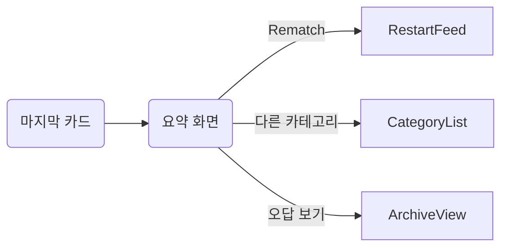

QuizRoom의 **스와이프 스택**만 딱 떼서 MVP → GA까지 바로 실행 가능한 빌드 플랜을 정리했어. (전체 프로젝트·빌드 맥락은 여기에 이미 잡혀 있어: 스와이프 스택/무한 피드·난이도 ELO·태그 기반 필터링.)

# 목표 정의

* **핵심 경험**: 끝없이 넘기는 1문항 카드 피드, “빠른 판단→즉시 보상→다음 카드”.
* **성과 지표(v1)**: 1세션당 완료 카드 ≥ 18장, 평균 응답시간 ≤ 5.5초, 다음 카드 로딩 대기 0ms 체감(프리페치 ≥ 3장).

# 1) UX·플로우 (MVP)

1. 홈 탭 → “스와이프” 진입 → 온보딩 1장(제스처 튜토리얼 5초).
2. 카드 구성

   * 상단: 카테고리/태그 칩, 난이도 점(●●○).
   * 본문: 질문(최대 80자) + 보조 미디어(선택).
   * 하단: 4지선다 버튼.
   * 제스처:

     * **정답 제출**: 보기 탭 → 즉시 채점 → 상단 토스트(±점수/연속기록).
     * **다음 카드**: 우측 스와이프(정답 후) / 상단 “다음” 스와이프 힌트.
     * **보류**: 상단으로 스와이프(스킵, 페널티 0점/연속 끊김).
     * **신고/저장**: 좌측 스와이프 홀드 → 액션 시트(신고, 다시보기).
3. 미세 피드백

   * 정답: 카드 테두리 스프링 애니메이션 + 햅틱(light).
   * 오답: 흔들림(shake) + 해설 2줄 노출(2.5초 자동접기).
4. 중단/복귀

   * 중단 시 진행 상태 로컬 보관(최근 20장), 복귀 시 같은 스택에서 이어서.

# 2) 데이터 모델 & API(Convex)

### 스키마 보강

* `questions`(기존): `difficulty`(0..1), `tags[]`, `answerIndex`, `explanation` 유지.
* 신규/보강:

  * `questions.elo`(number, 600–2400 범위 초기화), `qualityScore`(likes/plays 가중).
  * `users.skill`(perTag ELO 맵 포함), `users.sessionPref`(lastSeenCursor 등).
  * `answers` 컬렉션 신설: (userId, questionId, isCorrect, timeMs, createdAt).

### 서버 함수(초안)

* `questions.getSwipeFeed({ cursor?, limit=20, tags?, excludeIds?, userSkill? })`

  * 랭킹 수식: `score = w1*matchSkill + w2*recency + w3*quality - w4*dupPenalty`.
  * 응답: `items[], nextCursor`.
* `answers.submit({ questionId, isCorrect, timeMs })`

  * 트랜잭션: `answers` 기록 → `users.skill[tag]` ELO 업데이트 → `questions.elo` 조정(섀도 업데이트, 배치 가능).
* `reports.create({ questionId, reason })`
* `swipe.bookmark({ questionId })`

# 3) 난이도 적응(간단 ELO)

* 기본식(사용자 스킬 `Su`, 문항 스킬 `Sq`):

  * 기대값 `Eu = 1 / (1 + 10^((Sq - Su)/400))`
  * 업데이트(정답=1, 오답=0):

    * `Su' = Su + Ku * (result - Eu)`
    * `Sq' = Sq + Kq * (Eu - result)`
* 파라미터 제안: `Ku=24`, `Kq=16`(신규 문항 초기 Kq↑), 태그별 독립 업데이트.
* 초기화: 사용자 태그 미보유 시 `Su=1200`, 문항 `Sq`는 기존 `difficulty`를 ELO로 매핑(예: 0.5→1200, 0.8→1600).

# 4) 클라이언트 구조 (Expo/TypeScript)

```
/app/(tabs)/swipe.tsx         // 엔트리
/components/swipe/SwipeStack.tsx
/components/swipe/SwipeCard.tsx
/components/swipe/AnswerSheet.tsx
/components/common/ResultToast.tsx
/lib/feed.ts                  // 질의/프리페치 훅
/lib/elo.ts                   // 클라 추정(UX용), 실제 갱신은 서버
```

### 핵심 훅(개념)

* `useSwipeFeed({ category, tags })`

  * 내부 상태: `queue`(최대 10장), `prefetch`(백그라운드 3장), `cursor`.
  * 이벤트: `onAnswered` → 낙관적 제거 → `answers.submit` → 실패 시 롤백.
* 제스처/렌더링: `react-native-gesture-handler` + `react-native-reanimated` 카드 스택(겹침 3장, 다음 카드 미리 보임 8px).

# 5) 퍼포먼스 & 안정성

* **프리페치 파이프라인**: 화면 진입 즉시 20장 → 뷰포트 기준 “앞으로 3장 남으면 추가 로드”.
* **메모리 관리**: 카드 언마운트 즉시 미디어 해제, 이미지 `expo-image` 캐시.
* **오프라인/지연**: 정답 제출은 큐잉 후 재시도; 2분 내 재연결 시 점수 동기화.
* **60fps 수칙**: 큰 이미지 변환 금지, Reanimated에서 translate/opacity만.

# 6) 분석 & A/B

* 이벤트: `Swipe.Start`, `Card.View`, `Card.Answer(correct, timeMs)`, `Card.Skip`, `Toast.Show`, `Feed.Refill`, `Error.SubmitRetry`.
* A/B 아이디어:

  1. 스킵 제스처 on/off, 2) 해설 자동펼침 vs 버튼, 3) 정답 후 자동-다음 vs 수동 스와이프.

# 7) 보안/거버넌스

* 클라에는 정답 인덱스 미포함(서버 채점), 제출은 서버 타임스탬프 기준.
* 신고 플로우 원탭(좌스와이프 홀드) → 서버 큐 + 대시보드.
* 민감어·표절 사전필터는 크리에이터 발행 단계에서(스택 피드는 소비 전용). 

# 8) 마일스톤(스와이프 스택 전용)

* **W1**: API 스켈레톤( `getSwipeFeed` / `submit` ), 카드/스택 UI, 프리페치.
* **W2**: ELO v1(태그별), 분석 이벤트, 북마크/신고. (빌드 플랜 Milestone B와 맞물림) 
* **W3**: 품질 랭킹 가중치 튜닝, 로딩/오류 UX, 접근성/햅틱 조정.
* **W4**: A/B 2개 롤아웃, 폴리싱 & 버그바시.

# 9) 테스트 계획(요약)

* **유닛**: `elo.ts` 기대값/업데이트 케이스, `feed.ts` 프리페치 경계.
* **E2E(Detox)**: 첫 진입 튜토, 연속 30장 처리, 오프라인 중 5건 제출 후 복귀 동기화.
* **성능**: 중저가 안드로이드에서 30장 연속 스와이프 60fps 유지.

# 10) 완료 기준(DoD)

* 20장 프리로드, 정답→다음 카드 UX 평균 300ms 이내.
* 서버/클라 이벤트 대시보드에서 세션당 카드 수·정답률·평균 응답시간 확인 가능.
* A/B 실험 스위치로 스킵/해설 정책 즉시 전환 가능.

---

## 구현 스니펫(요약)

### getSwipeFeed (서버 의사코드)

```ts
// convex/functions/questions.ts
export const getSwipeFeed = query(async ({ db, args, auth }) => {
  const { cursor, limit = 20, tags = [], userSkill } = args;
  // 1) 후보군: 최신·품질 상위 n*3
  const base = await db.query("questions")
    .withIndex("byCreatedAt")
    .filter(q => tags.length ? q.tags.some(t => tags.includes(t)) : true)
    .take(limit * 3, { cursor });

  // 2) 매칭 점수
  const scored = base.map(q => {
    const sq = q.elo ?? mapDifficultyToElo(q.difficulty);
    const su = estimateUserSkill(userSkill, q.tags);
    const matchSkill = 1 - Math.abs(sq - su) / 800; // 0..1
    const recency = recencyWeight(q.createdAt);
    const quality = q.qualityScore ?? 0.5;
    const dupPenalty = 0; // 클라 excludeIds로 보정
    const score = 0.55*matchSkill + 0.25*recency + 0.20*quality - 0.10*dupPenalty;
    return { q, score };
  }).sort((a,b) => b.score - a.score).slice(0, limit);

  return { items: scored.map(s => stripAnswer(s.q)), nextCursor: calcCursor(base) };
});
```

### 클라이언트 스택(핵심 로직)

```tsx
// /components/swipe/SwipeStack.tsx
export function SwipeStack({ tags }: { tags?: string[] }) {
  const { queue, loadMore, submitAnswer } = useSwipeFeed({ category, tags });

  const onSelect = useCallback(async (q, choiceIdx) => {
    const isCorrect = choiceIdx === q.answerIndex; // 클라 미노출이 이상적, 서버 채점이면 여기선 전송만
    optimisticPop(q.id);
    await submitAnswer({ id: q.id, isCorrect, timeMs: perfNow() - q.ts });
    if (queue.length < 3) loadMore();
  }, [queue.length]);

  return <StackRenderer items={queue} onAnswer={onSelect} />;
}
```

---

스와이프 스택에서 “20문항 이후 UX”는 **세션 완주 피드백 + 재진입 루프 설계**가 핵심이에요.
유저가 “끝났다”는 만족감도 느끼고, 동시에 “다시 하고 싶다”는 동기까지 만들어야 합니다.

---

## 🎯 UX 설계 목표

1. **세션 완주 피드백** – 내가 뭔가 성취했다는 감각
2. **소셜/재도전 유도** – 리텐션 동기 부여
3. **자연스러운 루프 진입** – 홈으로 돌아가거나 다음 세션으로 이어짐

---

## 🧩 20문항 이후 플로우

### ① ✅ 결과 요약 카드 (Completion Sheet)

스와이프 마지막 문항 이후 자동 등장하는 카드

**내용 예시**

* 🎉 “20문항 완주!”
* “정답률 75% · 평균 반응속도 4.8초 ⚡”
* “이번 주 당신의 최고 점수는 1,200점!”

**UX 구성**

* 상단: 축하 애니메이션 (Confetti, 진동)
* 중앙: 통계 요약 (정답률·스피드·랭크)
* 하단 버튼:

  * **“다시 도전” (Rematch)** → 같은 카테고리 새 피드
  * **“다른 카테고리 도전”** → 카테고리 선택 화면으로
  * **“오답노트 보기”** (선택) → 아카이브로 이동



---

### ② 🔁 리매치 UX

리매치는 “새로운 20문항을 즉시 시작”

* 서버에서 `getSwipeFeed({ excludeIds: recentSeenIds })`로 중복 제외
* UX: 버튼 누르면 “다음 세트 준비 중…” 스켈레톤 애니메이션
* 피드 새로고침 후 첫 문항 자동 등장

**추가 요소**

* “지난 세션보다 더 높이 갈까?” 식 문구
* 점수 비교: “이전 세션 1,200점 → 이번 1,350점!”

---

### ③ 🕒 쿨다운 피드백 (선택)

하루 1회 리셋 구조면,

* 완주 후 “오늘의 퀴즈 완료! 🌟”
* 하단에 카운트다운: “다음 퀴즈 6시간 후 리셋됩니다 ⏰”
  → 반복 방문 유도 (데일리 리프레시 구조에 적합)

---

### ④ 🧠 오답/복습 모드 (선택)

* “다시 보기”에서 최근 20문항 중 오답만 카드로 재진행
* UX: 회색톤 카드 + 해설 강조
* 완료 시 “복습 완료!” 트로피 이모티콘

---

### ⑤ 🎁 리워드/배지 (가볍게라도)

* 첫 완주 시: “카테고리 첫 완주 배지 획득 🏅”
* 3세션 완주 시: “스피드러너 🔥” 배지
* 배지는 단순히 유저 프로필에 표시되면 충분함 (게임화 요소)

---

## 🧠 예시 화면 플로우 (요약)

| 단계 | UX 요소                 | 설명                  |
| -- | --------------------- | ------------------- |
| 1  | 🃏 카드 1~20            | 일반 문제 진행            |
| 2  | 🎉 결과 카드              | 통계, 점수, 애니메이션       |
| 3  | 🔁 리매치 / 🔍 오답 / 🏠 홈 | 3버튼 구조              |
| 4  | ⏰ 리셋 피드백 (선택)         | “다음 퀴즈는 6시간 후” 표시   |
| 5  | 💬 소셜 CTA (선택)        | “친구에게 공유” / “랭킹 비교” |

---

## 📱 실제 UI 예시 (구조)

```tsx
<CardSummary>
  <ConfettiAnimation />
  <h2>🎉 20문항 완주!</h2>
  <p>정답률 80% · 평균 반응속도 4.5초</p>

  <div className="mt-4 flex flex-col gap-2">
    <Button variant="primary">다시 도전하기</Button>
    <Button variant="outline">다른 카테고리로</Button>
    <Button variant="ghost">오답 보기</Button>
  </div>

  <small className="text-gray-400 mt-4">
    다음 퀴즈는 6시간 후 리셋됩니다 ⏰
  </small>
</CardSummary>
```

---

## 🚀 장기적으로 확장할 때

* **레벨 시스템**: 5세션 완주 → 카테고리 레벨업
* **카테고리 진행률 바**: 100문항 중 80문항 봤을 때 “완료도 80%” 표시
* **추천 루프**: “이번엔 [테크 트렌드] 카테고리에 도전해보세요!”

---

## ✅ 결론 요약

| 항목       | 권장 UX                 |
| -------- | --------------------- |
| 완주 문항 수  | 20                    |
| 완주 후     | “결과 요약 카드” 자동 등장      |
| 주요 버튼    | 리매치 / 다른 카테고리 / 오답 보기 |
| 세션 리셋 주기 | 24시간 or 즉시 리매치        |
| 감정적 피드백  | Confetti + 정답률 + 배지   |
| 학습 모드    | 오답 복습 or 전체 보기로 분리    |

---

📌 **한 줄 요약**

> 스와이프 스택은 ‘무한 피드’보다 ‘20문항 완주 후 보상감 + 리매치 유도’가 훨씬 몰입도가 높아요.
> 20문항 이후에는 **결과 요약 → 리매치 or 복습 or 다음 카테고리**로 자연스럽게 이어지게 설계하세요.

---